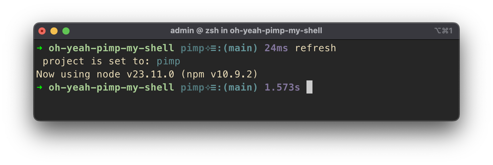

# @fab1o/pimp-my-shell



## 📚 Table of Contents

- [Oh My Posh Theme](#oh-my-posh-theme)
- [Oh My Zsh Aliases and Functions](#aliases--functions)
- [Requirements](#requirements)
- [Setup](#setup)
- [Help](#help)

---

This Oh My Posh theme is **loosely inspired** by the classic [robbyrussell Oh My Zsh theme](https://ohmyz.sh/).  
The corresponding [Oh My Posh version](https://ohmyposh.dev/docs/themes#robbyrussell) had a [known issue](https://github.com/JanDeDobbeleer/pimp-my-shell/issues/6204) where the ✗ character was incorrectly configured — this theme fixes that.

---

## ✅ Requirements

- **Required:** [Oh My Zsh](https://ohmyz.sh/)
- **Highly Recommended:**
  - [Oh My Posh](https://ohmyposh.dev/) with [Nerd Fonts](https://ohmyposh.dev/docs/installation/fonts)
  - [gum](https://github.com/charmbracelet/gum) for enhanced terminal UX
  - [glow](https://github.com/charmbracelet/glow) for enhanced terminal UX
  - [GitHub CLI](https://github.com/cli/cli) — needed for features like PR creation
- **Recommended:**
  - [iTerm2](https://iterm2.com/) or a modern terminal emulator
  - [Gruvbox color palette](https://github.com/herrbischoff/iterm2-gruvbox) or similar

---

## ⚙️ Setup

### Oh My Posh Theme

- Theme file: [`~/.pimp/pimp.omp.json`](dist/pimp.omp.json)  
- For detailed instructions, follow the [setup guide](doc/setup.md)

### Aliases & Functions

- Aliases and functions are compatible with **Oh My Zsh** alone or in combination with **Oh My Posh**
- Source files:
  - [`~/.pimp/pimp.zsh`](dist/pimp.zsh)
  - [`~/.pimp/config/pimp.zshenv`](dist/config/pimp.zshenv)
- See [setup guide](doc/setup.md) for installation and usage.

---

## 🆘 Help

Open your terminal and type:

```sh
help
```

---
